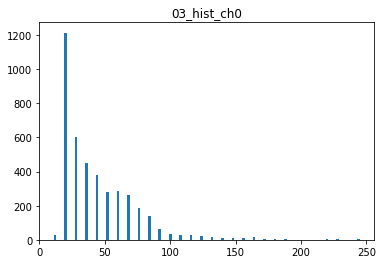
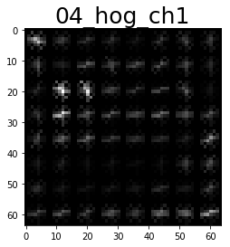

# Vehicle Detection Project

The goals / steps of this project are the following:

* Perform a Histogram of Oriented Gradients (HOG) feature extraction on a labeled training set of images and train a classifier Linear SVM classifier
* Optionally, you can also apply a color transform and append binned color features, as well as histograms of color, to your HOG feature vector. 
* Note: for those first two steps don't forget to normalize your features and randomize a selection for training and testing.
* Implement a sliding-window technique and use your trained classifier to search for vehicles in images.
* Run your pipeline on a video stream (start with the test_video.mp4 and later implement on full project_video.mp4) and create a heat map of recurring detections frame by frame to reject outliers and follow detected vehicles.
* Estimate a bounding box for vehicles detected.

## [Rubric Points](https://review.udacity.com/#!/rubrics/513/view) 
Here I will consider the rubric points individually and describe how I addressed each point in my implementation.  


### Writeup / README

#### 1. Provide a Writeup / README that includes all the rubric points and how you addressed each one.  

You're reading it!

### Histogram of Oriented Gradients (HOG)

#### 1. Explain how you extracted HOG features from the training images.

The extract_featurs method of the 'FeatureExtractor' class, takes a list of images and extracts a feature vector for each image within that list. 

This is done by calling the single_img_features method, which performs the HOG feature extraction as well as the extraction of spatial features and histogram features. Depending on the desired HOG-channel, the HOG feature vector can contain the HOG features of a single image-channel or a concatenated version of all three image-channels. 

The code for the actual HOG feature-extraction is contained in the get_hog_features method of the FeatureExtractor class in the IPython notebook.


I started by reading in all the `vehicle` and `non-vehicle` images.  
For the vehicle images, I used the provided images from the KITTI dataset as well as all GTI images (8792 images).
For the non-vehicle images, I used the GTI dataset as well as the Extras dataset (8968 images). 
The data is loaded in the 'Load Data' cell of the jupyter notebook.

**Here is an example of one of each of the `vehicle` and `non-vehicle` classes:**

 		

I then explored different color spaces and different `skimage.hog()` parameters (`orientations`, `pixels_per_cell`, and `cells_per_block`).  I grabbed random images from each of the two classes and displayed them to get a feel for what the `skimage.hog()` output looks like.

Here is an example using the `YCrCb` color space and HOG parameters of `orientations=9`, `pixels_per_cell=(8, 8)` and `cells_per_block=(2, 2)`:

**Example of the feature vector compensation of a car image:**

  <table style="border-collapse: collapse; border: none;">
        <tr style="border: none;">
            <td style="border: none;">
		
            </td>
            <td style="border: none;">
		
            </td>
            <td style="border: none;">
		
            </td>
            <td style="border: none;">
		
            </td>
        </tr>
        <tr style="border: none;">
            <td style="border: none;">
		
            </td>
            <td style="border: none;">
		
            </td>
            <td style="border: none;">
		
            </td>
            <td style="border: none;">
		
            </td>
        </tr>
        <tr style="border: none;">
            <td style="border: none;">
		
            </td>
            <td style="border: none;">
		
            </td>
            <td style="border: none;">
		
            </td>
            <td style="border: none;">
		
            </td>
        </tr>
    </table> 

**Example of the feature vector compensation of a non-car image:**

  <table style="border-collapse: collapse; border: none;">
        <tr style="border: none;">
            <td style="border: none;">
		
            </td>
            <td style="border: none;">
		
            </td>
            <td style="border: none;">
		
            </td>
            <td style="border: none;">
		
            </td>
        </tr>
        <tr style="border: none;">
            <td style="border: none;">
		
            </td>
            <td style="border: none;">
		
            </td>
            <td style="border: none;">
		
            </td>
            <td style="border: none;">
		
            </td>
        </tr>
        <tr style="border: none;">
            <td style="border: none;">
		
            </td>
            <td style="border: none;">
		
            </td>
            <td style="border: none;">
		
            </td>
            <td style="border: none;">
		
            </td>
        </tr>
    </table> 
  

#### 2. Explain how you settled on your final choice of HOG parameters.

I tried various combinations of parameters and the following combination lead to a promising result:
```
color_space = YCrCb
color channel=ALL
orientations = 9
pixels_per_cell= 8
cells_per_block=2
```

The parameter definition is done via member-variables of the FeatureExtractor class. 
They are set in the Prepare cell of the jupyter notebook. 

Together with the histogram (`hist_bins=32`) and spatial (`size=(16, 16)`) features, the feature vector contains 6156 values.


#### 3. Describe how (and identify where in your code) you trained a classifier using your selected HOG features (and color features if you used them).

I trained a linear SVM using 80 Percent of the training data and saved 20 Percent for Testing.
The SVM reaced an accuracy of 99.07 Percent.

### Sliding Window Search

#### 1. Describe how (and identify where in your code) you implemented a sliding window search.  
How did you decide what scales to search and how much to overlap windows?

I decided to search only the area close to the car in order to speed-up the classification as well as avoiding false positives. I only considered pixels with an y-value from 400 to 656. 

The sliding window search is performed in the find_cars method of the FeatureExtractor class. 

Within that area, I decided to slide windows of four different sizes (`scale = 1, 1.33, 1.66, 2`). 
Each of the windows slides with 2 `cells_per_step`, resulting in an overlap of 75 Percent. 

The output boxes of positively classified windows are combined in a heatmap.
Using a threshold of 1 in that heatmap causes single false-detections to decrease.

#### 2. Show some examples of test images to demonstrate how your pipeline is working.  
What did you do to optimize the performance of your classifier?

Ultimately I searched on two scales using YCrCb 3-channel HOG features plus spatially binned color and histograms of color in the feature vector, which provided a nice result.  

**Here are some example images:**

  <table style="border-collapse: collapse; border: none;">
        <tr style="border: none;">
            <td style="border: none;">
		
            </td>
            <td style="border: none;">
		
            </td>
        </tr>
        <tr style="border: none;">
            <td style="border: none;">
		
            </td>
            <td style="border: none;">
		
            </td>
        </tr>
        <tr style="border: none;">
            <td style="border: none;">
		
            </td>
            <td style="border: none;">
		
            </td>
        </tr>
        <tr style="border: none;">
            <td style="border: none;">
		
            </td>
            <td style="border: none;">
		
            </td>
        </tr>	
    </table> 


### Video Implementation

#### 1. Provide a link to your final video output. 

Here's a [link to my video result](./test_videos_output/project_video.mp4)


#### 2. Describe how you implemented some kind of filter for false positives and some method for combining overlapping bounding boxes.

The VehicleDetector class provides the process_image function used to process the single video frames. 
Additionally the class also saves the heatmaps of the last 10 frames in the video. 
Averaging over the recent heatmaps and applying a threshold (0.66) is used to improve the performance of the detection over multiple frames. 

I then used `scipy.ndimage.measurements.label()` to identify individual blobs in the heatmap.  
I then assumed each blob corresponded to a vehicle.  
I constructed bounding boxes to cover the area of each blob detected.  

Here's an example result showing the heatmap from a series of frames of video, the result of `scipy.ndimage.measurements.label()` and the bounding boxes then overlaid on the last frame of video:

**Here are six frames and their corresponding heatmaps:**


**Here is the output of `scipy.ndimage.measurements.label()` on the integrated heatmap from all ten frames:**


**Here the resulting bounding boxes are drawn onto the last frame in the series:**


---

### Discussion

#### 1. Briefly discuss any problems / issues you faced in your implementation of this project.  
Where will your pipeline likely fail?  
What could you do to make it more robust?

The implementation performs well using the project video, but there is still plenty of room for improvement.
The bounding boxes are sometimes too large and sometimges too small, or do only cover the trunk of the cars.
Further-away-cars are not identified since rather large-scaled versions of the car images were used.
Since I have a rather old Notebook, running the pipeline takes pretty long and thus, only a greatly limited number of parameter combinations was evaluated. 

* Training a more advanced classifier like a non-linear SVM or a Neuronal Network could improve the classification abilities. 

* The pipeline might fail in exotic situations which it was not trained for. 
E.g. special shaped cars (trucks, motorcycles, etc), in special environments (tunnels, difficult lightning conditions, rain, snow, night).

* Other than that the pipeline is likely to fail on very curvey or mountainous roads since the area of interest might not be in the right place here. 
As already mentioned, the proposed approach does not detect very far away vehicles (e.g. on a curvy road). 

* A nice approach would be to implement a prediction of detected vehicles for future frames e.g., using a linear model and track them over time. 
Another idea is to improve the classifier in order to detect and classify different kind of vehicles (bikes, cars, trucks, ..), or also pedestrians. 
